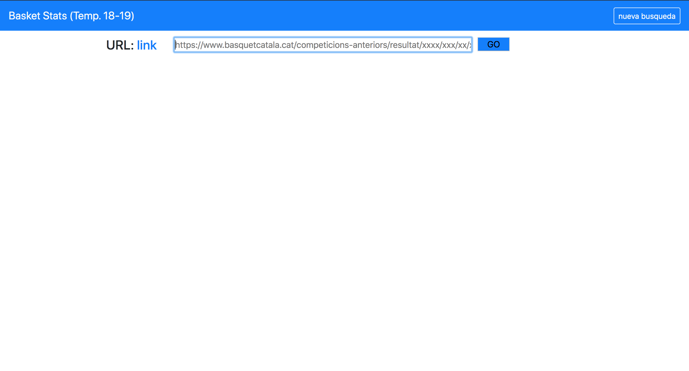
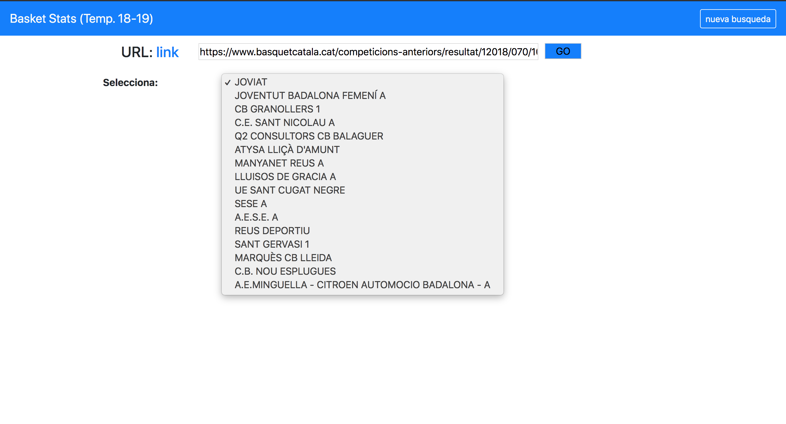
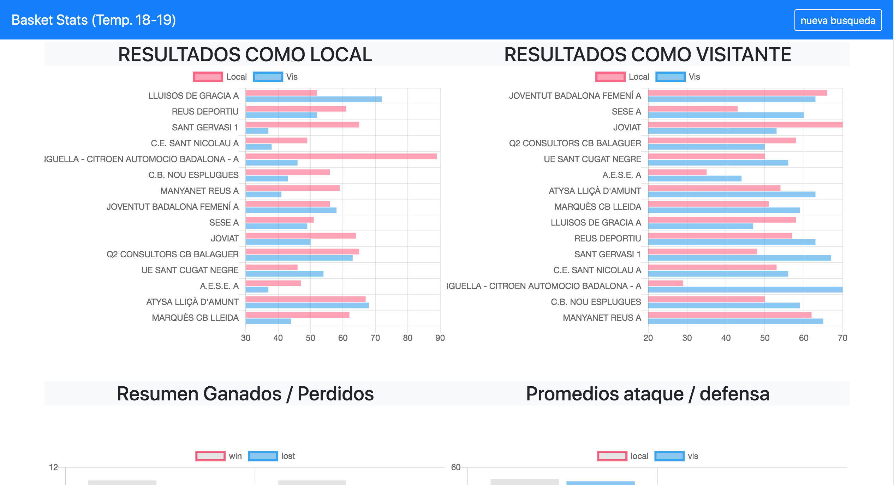

# docker_BasketCat_Stats





## Steps to run this app

requirements:

- Docker daemon running

```
git clone https://github.com/jnk-beneyto/basketStatsDocker.git
cd basketStatsDocker
docker-compose up
```

http://localhost:3000

# copy and paste this link on browser's app

https://www.basquetcatala.cat/competicions-anteriors/resultat/12018/070/101/01
